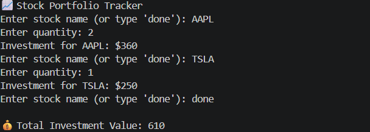

# 📈 Stock Portfolio Tracker

## 🌟 CodeAlpha Python Programming Internship – Task 2

## 📌 Project Overview

This project is a simple Stock Portfolio Tracker developed using Python.

## 🎯 Objective

To understand Python basics and financial calculation logic.

## 🛠 Tools Used

- Python 🐍
- VS Code

## ✨ Features

### Predefined stock prices
### Multiple stock input
### Total calculation

## 📚 Concepts Used

### Dictionary
### Loops
### Conditions

## 📸 Output

## 🎯 Conclusion

This project helps in understanding Python fundamentals.

## 👩‍💻 Author

Chinta Ramalakshmi